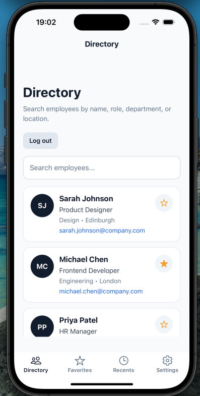
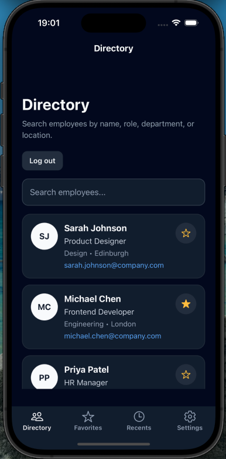
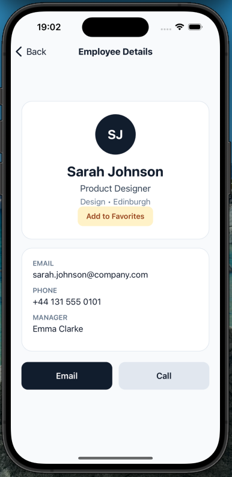
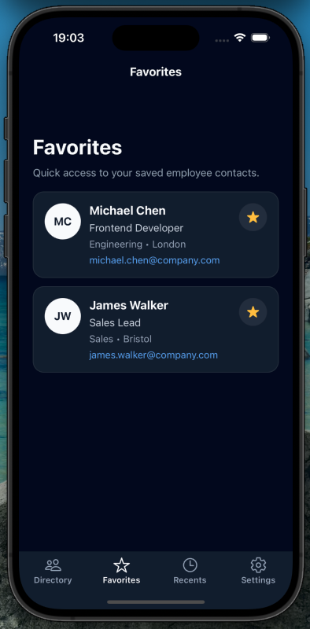

# Staff Directory App

A mobile staff directory app built with **React Native**, **Expo**, and **TypeScript**.

## Overview

This project allows users to browse employee contacts in a clean mobile interface, search by different fields, save favorites, view recent contacts, and open employee details.

It was built as a portfolio project to demonstrate practical mobile development skills, reusable components, navigation, state management, and theme support.

## Features

- Browse a staff directory
- Search employees by **name, role, department, or location**
- View employee details
- Save and remove favorite contacts
- Access recent contacts
- Light and dark mode support
- Reusable employee card component
- Clean mobile-first UI

## Tech Stack

- React Native
- Expo
- TypeScript
- React Navigation
- Zustand
- AsyncStorage

## Screenshots

### Directory Screen



### Dark Mode



### Employee Details



### Favorites



````
## Run the Project

```bash
npm install
npx expo start
````
